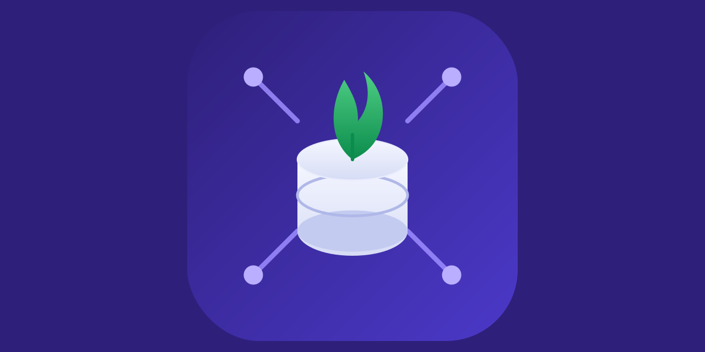

<div align="center">
  

  **Manage MongoDB users, roles, collections and indexes as Terraform resources — including AWS DocumentDB.**

  [](go.mod)
  [](https://github.com/Kaginari/terraform-provider-mongodb/releases/latest)
  [](LICENSE)
  [](https://github.com/Kaginari/terraform-provider-mongodb/actions/workflows/golangci.yml)
  [](https://github.com/Kaginari/terraform-provider-mongodb/issues)

  [📖 Registry docs](https://registry.terraform.io/providers/Kaginari/mongodb/latest/docs) · [🐛 Report an issue](https://github.com/Kaginari/terraform-provider-mongodb/issues/new) · [💡 Request a feature](https://github.com/Kaginari/terraform-provider-mongodb/issues/new)
</div>

---

## 📦 Resources

| Resource | Manages |
|---|---|
| [`mongodb_db_user`](docs/resources/database_user.md) | Database users — SCRAM password auth, or passwordless IAM auth on DocumentDB |
| [`mongodb_db_role`](docs/resources/database_role.md) | Custom roles with privileges and inherited roles |
| [`mongodb_db_collection`](docs/resources/database_collection.md) | Collections — with a `deletion_protection` safety flag |
| [`mongodb_db_index`](docs/resources/database_index.md) | Indexes — compound keys, partial filters, hideable without a rebuild |

## ⚡ Quick start

```hcl
terraform {
  required_providers {
    mongodb = {
      source  = "Kaginari/mongodb"
      version = "~> 1.0"
    }
  }
}

provider "mongodb" {
  host          = "127.0.0.1"
  port          = "27017"
  username      = "root"
  password      = "root"
  auth_database = "admin"
}

resource "mongodb_db_role" "app" {
  name     = "app_role"
  database = "admin"
  privilege {
    db      = "app"
    actions = ["find", "insert", "update", "remove"]
  }
}

resource "mongodb_db_user" "app" {
  name          = "app_user"
  password      = var.app_password
  auth_database = "app"
  role {
    role = mongodb_db_role.app.name
    db   = "admin"
  }
}
```

Full argument reference and more examples: [registry.terraform.io/providers/Kaginari/mongodb](https://registry.terraform.io/providers/Kaginari/mongodb/latest/docs).

## 🔐 Also supports

- **TLS**, including X.509 client-certificate authentication (`certificate_key_file`)
- **AWS DocumentDB**, including IAM authentication (`auth_mechanisms`, no password needed)
- **SOCKS5 proxying** for connecting through a bastion

## 🛠 Requirements

- [Terraform](https://www.terraform.io/downloads.html) >= 0.13
- [Go](https://golang.org/doc/install) >= 1.17 (only needed to build from source)

## 🧑‍💻 Building from source

```bash
git clone https://github.com/Kaginari/terraform-provider-mongodb
cd terraform-provider-mongodb
make install
```

## 🧪 Testing locally

**1. Start a local MongoDB with TLS**
```bash
cd docker/docker-mongo-ssl
docker build -t mongo-local .
```
Follow [this guide](https://ritesh-yadav.github.io/tech/getting-valid-ssl-certificate-for-localhost-from-letsencrypt/) to get a valid local TLS cert, then add to `/etc/hosts`:
```
127.0.0.1   kaginar.herokuapp.com
```

**2. Start the stack**
```bash
cd docker
docker-compose up -d
```

**3. Create an admin user**
```bash
docker exec -it mongo mongo
> use admin
> db.createUser({ user: "root", pwd: "root", roles: ["userAdminAnyDatabase", "dbAdminAnyDatabase", "readWriteAnyDatabase"] })
```

**4. Build and apply the examples**
```bash
make install   # builds the provider and runs terraform init against examples/
cd mongodb
make apply
```

## 🤝 Contributing

Issues and PRs are welcome. See [open issues](https://github.com/Kaginari/terraform-provider-mongodb/issues) for known gaps, or open a new one to propose a feature.

## 📄 License

See [LICENSE](LICENSE).
